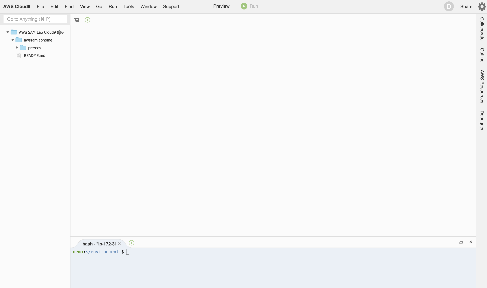
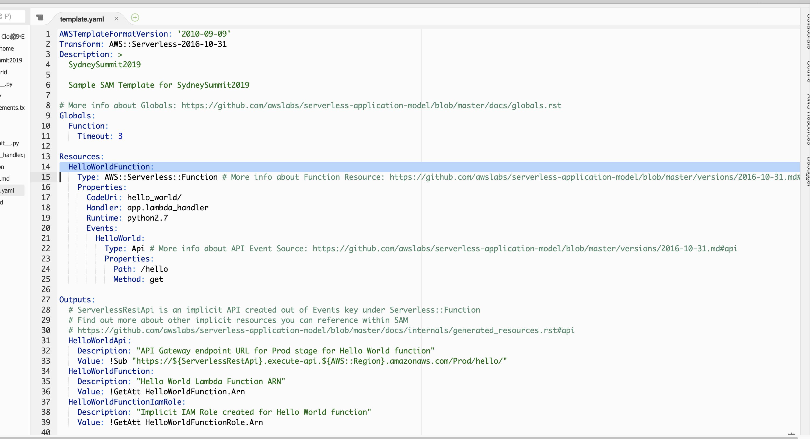

# AWS Summit Sydney 2019 - Dev Central
# Getting started with AWS Serverless Application Model (AWS SAM)

This lab walks you through the steps to build a sample serverless application using the AWS Serverless Application Model (AWS SAM). The AWS Serverless Application Model (SAM) is an open-source framework for building serverless applications. It provides shorthand syntax to express functions, APIs, databases, and event source mappings. AWS SAM is an extension of AWS CloudFormation, so you get the reliable deployment capabilities of CloudFormation. 

## Let's get started

You will build a serverless application that represents a simple API backend. It has an Amazon API Gateway endpoint that supports a GET operation and a Lambda function. When a GET request is sent to the endpoint, API Gateway invokes the Lambda function. Then, AWS Lambda executes the function, which simply returns a message.

Here is how you are going to initialize, test and deploy your application using **AWS SAM**: 

1. **Initialize** Create a sample application ``` sam init ```
2. **Test Locally** Test the application locally using ``` sam local start-api ``` 

For the **bravehearts** you can:

3. **Optional** Experiment with AWS Cloud9 IDE features to work with AWS Lambda functions and their related Amazon API Gateway APIs

4. **Package** After testing our application you will create a deployment package (including any depedencies) ``` sam package ```
5. **Deploy** Use the deployment package to deploy the application to AWS ``` sam deploy ```


Finally:

6. **Clean up**


Go to **Cloud9** on the AWS Web console - this is your IDE in the cloud.
You can also use your local IDE for all the steps of this lab.

* on top right corner - **Switch to US East(N. Virginia)**
* on the left hand pane click on **"Your environments"**


Open the **AWS SAM Lab Cloud9 Env** By clicking on **Open IDE**




### Step[0] = Before you begin

To work with AWS SAM CLI, you need the following:

1. AWS Command Line Interface (AWS CLI)
2. Docker 

Cloud9 comes with AWS CLI and Docker installed. Lets make sure you have **AWS SAM version > 0.14**


Once Inside Cloud9 - Open the Terminal :

```
$ sam --version 
```


**Optional Step** If you notice that **SAM CLI** version is not 0.14 or above, update it:

```
$ ./awssamlabhome/prereqs/init.sh 
$ clear
$ sam --version 
```


### Step[1] = Initialize an application 

1. Run the following command to create a python 2.7 application called SydneySummit2019

```
$ sam init --runtime python2.7 --name SydneySummit2019
```

_AWS Lambda supports additional languages for creating application code. If you specify another supported runtime, the init command provides the Hello World code in the specified language_

2. Review the contents of the directory that the command created **SydneySummit2019/**


**SydneySummit2019/template.yaml** Defines two AWS resources that the Hello World application needs: a Lambda function and an API Gateway endpoint that supports a GET operation. The template also defines mapping between the two resources.



**SydneySummit2019/hello_world/** directory contains application code, but let's get back to it later.

### Step[2] = Test the Application Locally 

Now lets test the application locally in Cloud9 IDE. 

1. Run following command from the directory containing **template.yaml**
   
```
$ cd SydneySummit2019/
$ pwd
$ sam local start-api
```


2. API Gateway endpoint URL is http://127.0.0.1:3000/hello. Open a new terminal and test the application using curl


```
$ curl http://127.0.0.1:3000/hello
```


3. After successfully testing your sample application, experiment with making a simple modification: change the message string that's returned.

In Cloud9 navigate to **SydneySummit2019/hello_world/app.py** and change return message from **hello world** to **sam lab 2019**. Hit the API Gateway local endpoint again and observe new string.

You will notice that your new code is loaded dynamically, without you having to restart the sam local process.


```
$ curl http://127.0.0.1:3000/hello
```


### (Optional) Step[3] =  Working with AWS Lambda Functions in Cloud9 IDE

AWS Cloud9 lets you Create, Run and Debug Lambda functions in your environment (local test) and remotely (within Lambda and API Gateway). Additionally you can also import existing functions into your environment, then make and upload changes to remote version in Lambda.

Start with clicking on the AWS Resources tab on the right of screen. Here you will see a list of Local and Remote functions. 


**Note** SydneySummitLambda2019 is listed as both local and remote because you used Cloud9 to create this function. The other remote function was created outside of Cloud9 (therefore not local) however you can still import and manage it using Cloud9. 

For now lets focus on testing a **Lambda and API GW locally** in Cloud9. 

1. Expand SydneySumit2019 under local functions and double click on HelloWorldFunction, edited the return message so the function returns **Hello from Cloud9**


2. Right click on function and run it local. 


The function is not expecting input in any specific format so lets just send a json saying hi to Cloud9 and hit Run


3. Now lets test the same function locally through API Gateway.


Click on Run to send a GET request to Lambda function through API GW. 


You can also edit lambda function configuration from Cloud9 IDE.


This will take you to **template.yaml** and you can experiement with setting lambda function timeout to **5** seconds (from 3).


### Step[4] = Package the Application 

You will now create a deployment package using AWS SAM CLI to deploy our application to the AWS Cloud.


1. Create an S3 bucket  where you want to save the packaged code. **Note** S3 bucket name must be globally unique. Append a random number to bucket nameand set it as environment variable. This will make it easier to clean up resources later. 
  
```
$ SYD_SUMMIT_SAM_LAB_2019_BUCKET=samlabsydneysummit$(date +%s)
$ aws s3 mb s3://$SYD_SUMMIT_SAM_LAB_2019_BUCKET
```

2. Create the Lambda function deployment package by running the following package AWS SAM CLI command at the command prompt.

_Make sure to run following command from the directory containing template.yaml (i.e. SydneySummit2019/)_

```
$ sam package --output-template-file packaged.yaml --s3-bucket $SYD_SUMMIT_SAM_LAB_2019_BUCKET

```


### Step[5] = Deploy the Application 

Now that you have created the deployment package, you use it to deploy the application to the AWS Cloud. You then test the application there.

1. use the deploy command to deploy all of the resources that you defined in the template.

```
$ sam deploy --template-file packaged.yaml --stack-name 'sydney-summit-sam-lab' --capabilities CAPABILITY_IAM

```

2. AWS CloudFormation creates the AWS resources as defined in the template, and groups them in an entity called a stack in AWS CloudFormation. You can access this stack in the [console](https://console.aws.amazon.com/cloudformation)


**To test the serverless application in the AWS Cloud**

1. Open the AWS [Lambda console](https://console.aws.amazon.com/lambda/)

2. In the navigation column on the left, choose Applications. In the list shown, choose the application that you created in the preceding step (application name is same as stack name)

3. Under Resources, expand the ServerlessRestApi item, and click the API endpoint URL.


4. Make sure to **append /hello** to the end of the URL and press Enter.

This sends a GET request to the endpoint. API Gateway invokes the Lambda function that the endpoint is mapped to. AWS Lambda executes the Lambda function and returns a message (specified in step 2.3 or 3.1). API Gateway returns a response with the text to the browser.


**Congratulations!** Your serverless application is running in AWS Cloud.


### Step[6] = Clean Up

1. Execute following script to clean up resource once you are done 

```
$ ./awssamlabhome/prereqs/cleanup.sh 
```
